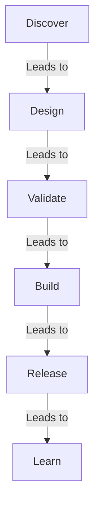

# AI Product Development Workflow

> A Human-AI product development workflow from idea to production, built around artifacts, validation gates, controlled releases, and evidence-driven iteration.

**Workflow V1.0** · 从公开项目 [What to Eat / 今天吃什么](https://github.com/1335389202-create/what-to-eat) 的真实交付过程抽取，并继续通过后续项目实践迭代。它覆盖想法澄清、产品与 UX 规格、原型验证、范围冻结、实施、测试、受控发布、生产验证和版本复盘。

## 1. Purpose

这套工作流用于指导人和 AI / Codex 如何把一个模糊想法逐步转化为已验证、已冻结、已实现、已测试并可公开发布的产品版本。它强调人类保留目标、范围、风险与发布责任；AI 负责加速分析、文档、实现和可重复验证。

它不是通用“万能模板”，也不是自动替人做产品决策的 Skill。项目规模不同，可以缩短阶段，但不能跳过与风险相匹配的决策、验证和变更传播。

> **Evidence Boundary — Engineering Evidence ≠ Product Evidence.** 自动化测试、代码审查、部署成功和生产 Smoke 可以证明实现符合已知规格、发布对象可运行；它们不能证明用户愿意使用、能够理解、持续留存，或产品创造了预期业务与社会价值。两类证据必须分开记录。

## 2. Workflow Overview



Discover 包含 Idea → Requirement Clarification → PRD；Design 包含 UX Design → Prototype Spec → Clickable Prototype；Validate 包含 Prototype Validation → Human Decision Gate → Scope Freeze；Build 包含 Implementation Planning → Implementation → Automated QA；Release 包含 Release Candidate → Human Release Gate → Production Deployment；Learn 包含 Production Validation → Retrospective → Next Iteration，并把新证据带回下一轮需求澄清。

详细流程由下面的原则、Stage Contract、Gate、Protocol 和证据模型共同定义。阶段名称可以按项目规模合并，但高风险决策点不能因为 AI 执行速度更快而被省略。

## 3. Core Principles

### 3.1 Human Decision Gate

产品方向、范围、风险边界和不可逆操作由人决定。AI 可以分析选项、提出建议和执行已批准任务，但不能用“合理默认”代替关键授权。

必须由人确认的典型事项：

- 产品定位、目标用户和核心场景；
- 哪个用户闭环是当前版本核心；
- P0/P1/P2 与 Scope Freeze；
- 食品安全、隐私、法律、支付等高风险语义；
- 数据删除、覆盖、迁移或不可逆格式变化；
- 正式技术栈和外部供应商；
- 创建公开仓库、push、部署和任何对外发布；
- 从规划进入正式实现；
- 发布是否接受剩余已知限制。

不需要人为逐项批准的事项：

- 已批准范围内的可逆实现细节；
- 不改变产品行为的整理；
- 运行测试、静态检查和只读诊断；
- 根据既定验收修复明确缺陷。

### 3.2 Artifact-driven Development

每个阶段都有可审阅产物，下一阶段读取前一阶段产物，而不是只依赖对话记忆。

```text
批准的需求
→ PRD（做什么）
→ UX Design（如何组织体验）
→ Prototype Spec（验证哪些状态和流程）
→ Clickable Prototype（可操作证据）
→ Validation Report（是否符合规格）
→ Scope Freeze / MVP Plan（本次实现什么）
→ Production Implementation（运行产品）
→ Tests / Release Report（是否可发布）
→ Retrospective / Next Plan（学到了什么、下一步为什么做）
```

一个产物只有在“状态、版本、来源和限制”明确时，才适合作为下一阶段输入。

### 3.3 Scope Freeze

进入 MVP 开发前冻结范围。冻结后：

- 已批准 P0 才进入当前版本；
- 新想法进入 Roadmap 或下一版本 backlog；
- 只有阻塞核心闭环、安全或数据完整性的发现可以触发范围复议；
- “代码顺手”“视觉更完整”“技术更高级”都不是扩大范围的理由；
- 任何范围变更需要说明新增价值、成本、风险和对既有验收的影响，并回到 Human Decision Gate。

### 3.4 Test Gate

Prototype 与 Production 的验收对象不同，必须分别保留：

- Prototype Test Gate：验证页面/状态、路径、样例数据、异常恢复和交互规格；
- Production Test Gate：验证真实代码、持久化、推荐、原子写入、响应式、无障碍和部署；
- Release Test Gate：验证资源路径、secret、仓库子路径、CI/CD 与线上 smoke。

“页面能打开”不是完成标准；“自动化全绿”也不是用户价值已经验证。

### 3.5 Stop Conditions

Codex 必须暂停并请求人类决定的情况：

1. 需要新的产品方向或会改变目标用户/核心闭环；
2. 必须扩大冻结范围才能继续；
3. 需要账号、Token、API Key、付费服务或第三方合同；
4. 需要删除、覆盖、迁移或公开用户数据且没有已批准保护方案；
5. 规格之间存在会产生不同产品行为的实质冲突；
6. 会破坏已批准的 Prototype、历史文档或生产基线；
7. 自动化测试经过合理定位与最小修复仍无法通过；
8. 涉及食品安全、医疗、法律、财务或隐私结论，现有证据不足；
9. 即将创建公开仓库、push、部署或发送外部信息，但尚未授权；
10. 实际结果与验收标准有偏差，需要接受风险或调整范围。

困难、耗时或需要更多检查本身不是停止理由。AI 应先穷尽安全、可逆、范围内的诊断。

### 3.6 Change Propagation

产品变化不能只改代码。每次变化先判断哪些事实层受影响：

```text
PRD
→ Design
→ Prototype Spec
→ Implementation
→ Tests
→ README / Release Notes
```

不同变化不必机械修改全部文件，但必须做影响判断并记录“不受影响”的理由。

## 4. Stage Contract

| 阶段 | 主要输入 | 核心活动 | 输出 | Gate / Exit Criteria |
|---|---|---|---|---|
| Idea | 用户问题、愿景或机会 | 识别要解决的问题，不急于列功能 | 一句话问题与初步价值 | 人确认值得继续探索 |
| Requirement Clarification | 初步构想 | 优先追问会改变架构、范围、数据与平台的问题 | 决策记录、未决问题 | 关键产品需求明确；人批准生成 PRD |
| PRD | 已确认决策 | 描述目标用户、场景、规则、数据、异常、MVP、验收 | PRD | “做什么”无架构级歧义；不提前选择技术栈 |
| UX Design | PRD | 信息架构、页面层级、状态、错误恢复、响应式、无障碍 | Design Document | 主流程和关键异常可被原型化 |
| Prototype Spec | PRD + Design | 冻结 Frame、样例、连线、测试任务和验收 | Prototype Spec | 范围、数据链和测试问题可执行 |
| Clickable Prototype | Spec | 用最低成本实现真实可点击路径 | Prototype | 核心路径、状态与 Overlay 可操作 |
| Prototype Validation | Prototype + Spec | 自动化规格验收 + 用户测试（如有） | 验收报告、问题清单 | 自动化通过；用户问题按严重度处理或记录 |
| Scope Freeze | 验证结果、资源限制 | 选择最小公开闭环，明确 Non-Goals | 冻结范围、Roadmap | 人批准；新增需求有明确去处 |
| Portfolio MVP Plan | 冻结范围、现有资产 | 拆 5–8 个可验证步骤，定义每步目标/范围/验收 | 轻量计划 | 人批准进入实现 |
| Implementation | 计划、规格、Prototype | 按步实现并保留已验证结构 | 生产代码 | 每步测试通过后才进入下一步 |
| Automated QA | 代码、验收标准 | 单元、集成/E2E、响应式、无障碍、异常和回归 | 测试结果 | 无已知阻塞缺陷；原基线不被破坏 |
| Open-source Packaging | 稳定 MVP | README、截图、LICENSE、ignore、敏感信息预检 | 可公开仓库内容 | 未实现功能不冒充已实现；无 secret/PII |
| CI/CD Deployment | 包装完成的静态项目 | 配置发布、子路径检查、线上 smoke | Live Demo | 实际 URL 可访问；自动部署闭环成立 |
| Portfolio Review | 线上版本、过程资产 | 从招聘者/协作者视角检查价值、证据和限制 | Review 结论 | 项目叙事与实际仓库一致 |
| Iteration Backlog | 反馈、限制、代码发现、研究 | 区分缺陷、优化、假设和 Roadmap | 有证据的候选问题 | 选择一个明确版本主题 |
| Version Iteration | 复盘 + 候选问题 | Benchmark、问题定义、范围、迁移、指标、发布标准 | Version Plan | 人批准进入 Implementation Planning |

## 5. Roles and Responsibilities

### 5.1 Human

- 提供产品意图、业务背景和真实约束；
- 决定优先级、范围、风险接受和发布；
- 对重要文案、体验方向和高风险语义作最终判断；
- 提供账号授权、真实用户反馈和外部资源；
- 审阅 AI 产物是否准确表达意图，而不只看格式完整。

### 5.2 AI / Codex

- 读取全部当前事实源后再提出方案；
- 主动找出会改变架构的歧义、异常和数据风险；
- 将假设、事实、推断和外部研究分开；
- 在批准范围内实现、测试、修复并持续报告；
- 保持改动精确，保护用户已有文件和历史资产；
- 发现传播面，避免 PRD、Design、代码、测试和 README 分裂；
- 在 Stop Condition 出现时暂停，而不是用脑补越过。

### 5.3 Shared Responsibility

- 人负责“是否值得做”和“是否接受风险”；
- AI 负责“事实是否完整”“方案是否一致”“验收是否可重复”；
- 双方共同负责把未验证假设写成假设，而不是写成结论。

## 6. Evidence Model

每个迭代计划的 Evidence 至少区分：

| 证据类型 | 示例 | 可以支持什么 | 不能支持什么 |
|---|---|---|---|
| 当前实现事实 | 代码、schema、线上页面 | 系统现在如何工作 | 用户喜欢或功能有效 |
| 自动化验证 | 76/76、82/82、smoke | 实现符合已知规格 | 真实可用性、留存、业务结果 |
| 用户明确输入 | 新需求、范围确认 | 产品方向与约束 | 大规模用户共识 |
| 用户研究 | 任务观察、访谈、反馈 | 理解、痛点与行为原因 | 未代表总体时的普遍结论 |
| 行为数据 | 漏斗、事件、失败率 | 实际行为模式 | 单独解释行为原因 |
| Benchmark | 公开仓库、竞品、行业资料 | 可参考做法与风险 | 直接证明适合本项目 |
| 假设 | “购买日期更容易填写” | 下一步需要验证的命题 | 作为已证实事实或目标值 |

外部研究应记录来源、读取时间、证据边界和是否采用。不得为了表格完整度虚构评分、用户原话或数据。

## 7. Human Decision Gate Checklist

在请求批准前，AI 应提供：

- 当前事实；
- 需要决定的问题；
- 2–3 个真实可选方案（如存在）；
- 每个方案对范围、数据、体验和后续架构的影响；
- 推荐方案与理由；
- 不决定会阻塞什么。

人批准后，决策进入相应事实源。后续阶段不得悄悄改回。

## 8. Scope Freeze Protocol

### 8.1 Freeze 内容

- 当前版本的核心用户闭环；
- P0 功能；
- 明确 Non-Goals；
- Mock/真实数据边界；
- 平台与部署边界；
- 测试基线；
- Roadmap 接收区。

### 8.2 新需求处理

```text
新想法
├── 阻塞核心闭环/安全/数据完整性？
│   ├── 是 → 形成范围变更提案 → Human Gate
│   └── 否
├── 当前已批准 P0 的必要组成？
│   ├── 是 → 记录为澄清，不扩大范围
│   └── 否 → 进入 P1/P2/Roadmap
```

### 8.3 Freeze 退出

只有当前版本发布并完成 retrospective，才默认重新打开下一版本范围。紧急缺陷走最小修复，不借机添加功能。

## 9. Test Gate Protocol

### 9.1 测试金字塔（按项目风险调整）

1. 纯规则/数据：日期、状态、推荐、迁移、扣减；
2. 存储与原子性：成功、失败、恢复、幂等；
3. 浏览器主流程：真实点击、刷新、LocalStorage；
4. 体验质量：响应式、触控、键盘、焦点、Reduce Motion；
5. 部署：HTTP、repository subpath、资源、控制台；
6. 发布：secret、隐私、README、Roadmap 诚实性；
7. 用户研究：理解、犹豫、误解和真实任务成功。

### 9.2 Gate 规则

- 当前步骤失败时先定位并修复，不带已知问题进入下一步；
- 原有基线与新增验收都要通过；
- 对失败进行最小修复，不用重写框架绕过；
- 测试夹具与产品规则使用同一事实，不在测试中复制另一套算法；
- 任何模拟失败控件只存在于测试接口或开发环境，不进入普通用户界面；
- 线上 green workflow 之后仍要实际打开 Live Demo smoke。

## 10. Change Propagation Protocol

### 10.1 影响判断矩阵

| 变化类型 | PRD | Design | Prototype Spec | Implementation | Tests | README |
|---|---:|---:|---:|---:|---:|---:|
| 产品定位/目标用户 | 必须 | 必须 | 必须 | 可能 | 必须 | 必须 |
| 核心流程/页面层级 | 必须 | 必须 | 必须 | 必须 | 必须 | 必须 |
| 业务规则/状态语义 | 必须 | 必须 | 必须 | 必须 | 必须 | 若公开可见则必须 |
| 数据模型/迁移 | 必须 | 若影响体验则必须 | 若影响样例则必须 | 必须 | 必须 | 数据策略必须 |
| 视觉样式 | 通常否 | 必须或 delta | 若验证视觉则更新 | 必须 | 质量测试 | 截图可能更新 |
| 纯内部重构 | 否 | 否 | 否 | 必须 | 必须 | 通常否 |
| Roadmap 调整 | 必须或版本计划 | 通常否 | 否 | 否 | 否 | 必须 |
| 部署方式 | 非产品 PRD | 否 | 否 | 配置 | 部署测试 | 必须 |

### 10.2 Propagation 顺序

1. 写清变化的 Problem 与 Evidence；
2. 更新最高层受影响事实源或创建 version delta；
3. 评估 UX 页面、状态、文案和异常；
4. 更新 Prototype Spec 或说明为何无需新原型；
5. 冻结 Implementation Planning；
6. 修改代码；
7. 更新/新增测试；
8. 功能实际完成后更新 README、截图和 release notes；
9. 执行发布与线上 smoke；
10. 版本复盘记录实际结果和偏差。

历史 V1.0 文档不应被静默重写成“从来就是 V2.0”。可通过版本号、delta 或 retrospective 保留当时事实。

## 11. Version Management

### 11.1 Version Lifecycle

每个产品版本至少包含：

```text
Problem
→ Scope
→ Design
→ Implementation
→ Validation
→ Release
→ Retrospective
```

版本计划记录发布前为什么做、做什么、不做什么和如何验收；复盘记录发布后实际完成、证据、偏差与下一问题。Git 保存精确历史，tag / release 必须对应已经验收并实际发布的 commit。

### 11.2 Recommended Product Artifacts

```text
docs/
├── research/
│   └── benchmark-review.md
├── iterations/
│   ├── v1.0-retrospective.md
│   ├── v2.0-plan.md
│   └── future-version-plan.md
└── workflow/
    └── ai-product-development-workflow.md
```

- Plan 说明未来意图，不能提前写成已实现事实；
- Retrospective 说明实际结果，并区分工程证据、产品证据与未知；
- Prototype 只在新流程或高风险交互需要验证时创建新版本；
- README 提供当前版本与关键历史入口，不承载全部内部细节；
- 历史文档通过版本、delta 和 Git 保留，不能被静默改写。

### 11.3 Independent Workflow Version Strategy

这个仓库对“工作流本身”独立版本化，不跟随任何案例项目的产品版本号。

| Workflow 版本 | 适用变化 | 发布表达 |
|---|---|---|
| **V1.0（当前）** | 首次独立发布完整方法、真实案例与证据边界 | Git tag `v1.0.0` |
| **V1.x** | 文档澄清、小型流程调整、新案例，以及经过验证的小型 prompts / templates | `v1.x.0`；纯勘误可使用 patch |
| **V2.0** | 经多个项目验证后的关键机制变化，例如可复用模板体系、Skill 化，或新的 Evidence / Gate 模型 | `v2.0.0`，并说明迁移与行为差异 |

规则：

- 工作流版本永远不复制 What to Eat 或其他案例项目的 V1.0、V2.0 编号；
- Major 版本只用于方法机制发生实质变化，不因措辞润色升级；
- 新模板、prompt 或 Skill 只有在独立验证后才进入未来版本，本次 V1.0 不包含这些资产；
- tag 只在 README 渲染、链接、范围和发布说明验证通过后创建；
- CHANGELOG 只记录本仓库的真实发布历史。
## 12. Working Cadence

### 12.1 Planning Update

持续工作的任务应给用户简短更新：当前阶段、已确认事实、正在验证什么、是否出现偏差。不要让用户需要从工具输出推断进度。

### 12.2 Execution Update

每个实现步骤记录：

- 实际完成；
- 测试结果；
- 与计划偏差；
- 新风险或假设；
- 是否可以进入下一步。

### 12.3 Final Handoff

最终报告应从结果开始，至少说明：

- 完成范围；
- 验证结果；
- 已知限制；
- 与计划偏差；
- 当前是否可进入下一阶段；
- 哪些决定仍需要人确认。

## 13. Minimal Templates

### 13.1 Version Plan

```text
Problem
Evidence（事实 / 用户输入 / 研究 / 假设）
Goals
Non-Goals
Change List（当前 / 问题 / 新方案 / 价值 / 影响 / 验收）
P0 / P1 / P2
Data & Migration
Metrics Definition
Release Criteria
Open Questions
```

### 13.2 Retrospective

```text
目标
实际完成
未完成
关键决策
验证证据
发布结果
限制与偏差
下一轮问题
经验
```

### 13.3 Change Request

```text
变更原因
当前事实
建议变化
用户价值
对范围/数据/体验/测试/发布的影响
替代方案
推荐决定
需要的人类授权
```

## 14. Anti-patterns

- 在关键需求明确前生成最终 PRD；
- 把 PRD 写成技术栈或数据库实现方案；
- 低保真阶段用高质量图片掩盖信息架构问题；
- 自动化通过后声称“用户已经验证”；
- 为展示技术能力迁移不需要的框架；
- Scope Freeze 后顺手实现 Roadmap；
- 只修改代码，不更新业务规则与测试；
- 在没有数据时填写漂亮的指标基线或目标；
- 把外部仓库的模板完整复制成本项目流程；
- 将 Mock、估算、AI 辅助或安全提醒描述成真实权威数据；
- 部署 workflow 绿色但没有打开正式 URL；
- 迁移失败时自动 reset 并覆盖用户数据；
- README 声称的目录、链接、功能和实际仓库不一致。

## 15. Benchmark Influence

本工作流吸收了公开参考项目的阶段确认、版本记录、P0/P1/P2 和文档分层思想，但关键规则来自本项目真实经历：

- Figma 权限受限后停止绕过，改为浏览器低保真原型；
- 24 Frame 与 76/76 独立验收后才冻结 Portfolio MVP；
- 优先复用原型而没有为了技术展示迁移 React/Vite；
- 82/82 后先做本地 HTTP 与 Pages 子路径验证，再申请公开部署；
- GitHub 登录是唯一授权阻塞点，授权完成后再执行外部操作；
- V2.0 先做 Benchmark、复盘、数据迁移与范围规划，不直接改生产代码。

这些经历说明，好的 AI 工作流不是步骤越多越好，而是每个高风险转折都有清晰输入、证据、Gate、验收和停止条件。

## 16. Real-world Case Study — What to Eat V2.0

- Public repository: [1335389202-create/what-to-eat](https://github.com/1335389202-create/what-to-eat)
- Live product: [What to Eat / 今天吃什么](https://1335389202-create.github.io/what-to-eat/)
- Release: [v2.0.0](https://github.com/1335389202-create/what-to-eat/releases/tag/v2.0.0)

What to Eat 是一个移动优先的“条件约束吃饭盲盒”。V1.0 已完成库存驱动的居家做饭闭环；复盘随后发现，“预计到期 / 临期”依赖用户难以可靠提供的信息，也可能被误读为食品安全判断。V2.0 因此把问题收缩为可诚实计算的“购买时长提醒”，并同时处理数据迁移、推荐解释、扣减顺序和发布风险。

实际交付路径：

```text
Problem discovery
→ Retrospective and benchmark review
→ Iteration plan
→ Change propagation across PRD / UX / prototype delta
→ Implementation plan
→ Feature branch and test-first implementation
→ Release candidate
→ Human release gate
→ Pull request
→ CI / GitHub Pages deployment
→ Production migration smoke
→ Tag and GitHub Release
→ Retrospective
```

| 阶段 / Gate | 实际输入与动作 | 控制的风险 |
|---|---|---|
| Problem Discovery | 识别“临期”依赖不可靠到期信息 | 避免只优化界面而保留错误产品事实 |
| Iteration Plan | 冻结购买日期、动态天数、`+2 / +3` 与 Non-goals | 防止语义修正扩成无边界功能堆叠 |
| Change Propagation | 同步 PRD、UX、Prototype Spec、实现计划、README 与 CHANGELOG | 防止代码、文案、数据和验收互相矛盾 |
| Migration-first Implementation | 先定义 Schema v1 → v2、备份、失败恢复和夹具 | 防止界面先行后再处理旧用户数据 |
| Automated Test Gate | 主项目 151、Prototype 76、部署 13、Release Preflight 14，共 254/254 | 固定已知规则、回归和发布对象 |
| Human Release Gate | 人工确认范围、安全文案、迁移风险和发布授权 | 保留不能交给自动化的产品责任 |
| PR and Deployment | PR #1 合并后由 GitHub Actions run 33038428516 发布 commit `63f1d657` | 确认生产使用受审查提交，而非手工复制 |
| Production Validation | 13/13 基础 Smoke 与 37/37 迁移、扣减、响应式和 Reduce Motion 专项检查 | 验证仓库子路径、真实模块、迁移与关键数据链 |
| Release and Retrospective | 线上验证后才创建 `v2.0.0`，随后记录偏差与未知 | 防止标签早于生产证据，并为下一轮保留真实输入 |

### Case-study Evidence Boundary

这组证据证明：冻结规格得到了实现，Schema 迁移和失败保护可重复验证，正式部署可运行，且发布对象经过人工门禁。它**没有证明**用户愿意维护购买日期、理解 `5 / 7` 天阈值、采纳推荐、持续使用产品，或真实减少了食材浪费。

因此案例的下一步不是凭测试数继续增加功能，而是通过小范围任务测试、访谈与最低必要的隐私友好指标补充产品证据。

---

Workflow V1.0 is released under the [MIT License](LICENSE). See [CHANGELOG.md](CHANGELOG.md) for repository history.
