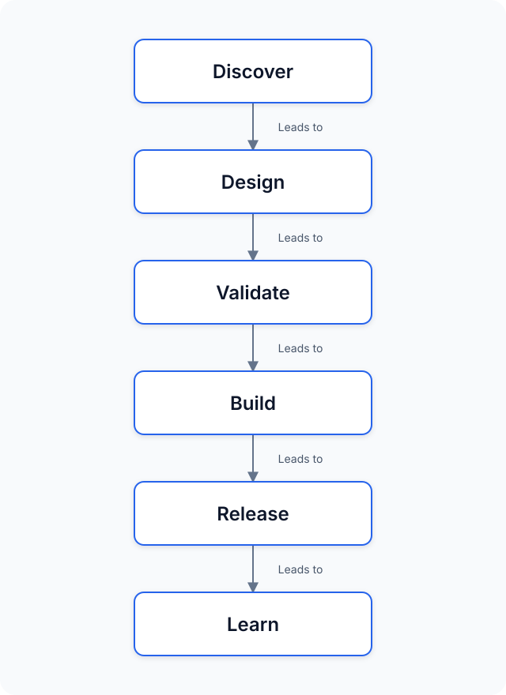

# AI Product Development Workflow

**Workflow V1.1 · Release Candidate** — A risk-adaptive, Human × AI collaborative product development workflow from idea through validated release and retrospective. Extracted from the [What to Eat / 今天吃什么](https://github.com/1335389202-create/what-to-eat) real-world delivery, now restructured for surface simplicity and on-demand rigor.

> **Core Principle:** *Use the lightest process that adequately controls the project's actual risk.*

---

## 1. What is this?

A structured workflow for humans and AI agents (Codex, Trae, Cursor, Claude, etc.) to turn a fuzzy idea into a validated, released product. Humans keep responsibility for goals, scope, risk, and release; AI accelerates analysis, documentation, implementation, and repeatable verification.

Not a universal template or an auto-pilot — depth is chosen by risk, not by project size.

## 2. Why this workflow exists

Common failure modes in AI-native product work:

- AI silently expands scope or redefines the stage it was asked to execute
- Artifacts drift out of sync with implementation
- **Tests passing are mistaken for user evidence or business value**
- Prototype validation and production validation are conflated
- AI crosses risk nodes that require explicit human decision authority
- Releases happen without clear authorization or evidence boundaries

---

## 3. Workflow at a Glance



```text
  Discover          ←───────────────────────────┐
     │                                            │
  Define                                           │ Next
     │                                            │ Iteration
  G1 — Scope Gate                                 │
     │                                            │
  Design                                           │
     │                                            │
  G2 — Design Gate                                │
     │                                            │
  Build                                            │
     │                                            │
  G3 — Build Gate                                 │
     │                                            │
  Validate                                         │
     │                                            │
  G4 — Release Gate                               │
     │                                            │
  Release & Learn  ───────────────────────────────┘
```

### Evidence Boundary (read this first)

- **Tests** show whether *defined behavior works* as specified.
- **User evidence** shows whether *people can understand or benefit* from the product.
- **Business value** requires *real-world outcomes*, not just green CI or clean code.

These three must never be conflated. No amount of automated coverage proves a user need.

---

## 4. The 6 Core Stages

Each stage is defined first by the question it answers.

| Stage | Core Question |
|---|---|
| **1. Discover** | Why should we build this? |
| **2. Define** | What exactly are we building — and *not* building? |
| **3. Design** | How should the solution work for the user? |
| **4. Build** | How do we implement the approved solution safely? |
| **5. Validate** | Did we build it correctly, and what does the evidence actually prove? |
| **6. Release & Learn** | Is it safe to release, and what should we learn next? |

### Stage Details

#### 1. Discover

Why should we build this?

- Typical activities: Problem framing, opportunity sizing, benchmark scan, user input capture, "is this worth doing?" judgment.
- Typical outputs: Problem statement + initial value hypothesis + decision whether to continue.

#### 2. Define

What exactly are we building — and *not* building?

- Typical activities: Requirement clarification, goal/non-goal definition, target user + core scenario, data/risk/constraint inventory, PRD drafting.
- Typical outputs: PRD or equivalent spec; explicit Non-Goals; known unknowns.
- **Leads to → G1 Scope Gate.**

#### 3. Design

How should the solution work for the user?

- Typical activities: UX information architecture, page/state/flow definition, exception/recovery design, prototype spec framing, clickable prototype build, prototype validation.
- Typical outputs: Design artifact (spec +/ prototype); validation report.
- **Leads to → G2 Design Gate.**

#### 4. Build

How do we implement the approved solution safely?

- Typical activities: Scope freeze confirmation, implementation planning, stepwise implementation, test-first coding, automated QA, regression checks.
- Typical outputs: Production code; passing test suites; change propagation record.
- **Leads to → G3 Build Gate.**

#### 5. Validate

Did we build it correctly, and what does the evidence actually prove?

- Typical activities: RC packaging, pre-release test gate, deployment smoke, evidence-type classification (engineering vs. user vs. business).
- Typical outputs: Validation report with explicit evidence boundaries; remaining known issues and risk list.
- **Leads to → G4 Release Gate.**

#### 6. Release & Learn

Is it safe to release, and what should we learn next?

- Typical activities: Human release authorization, production deploy, post-release smoke, user/behavior evidence collection, retrospective, next iteration planning.
- Typical outputs: Released version; retrospective; next-iteration problem statement and evidence backlog.
- **Loops back → next Discover / Define cycle.**

---

## 5. The 4 Human Gates

Gates are *not* optional speedbumps. They are places where a human explicitly accepts scope, design, implementation-readiness, or release risk.

| Gate | Position | Core Question |
|---|---|---|
| **G1 — Scope Gate** | Define → Design | Is the problem and scope clear enough to design? |
| **G2 — Design Gate** | Design → Build | Is the solution clear enough to build? |
| **G3 — Build Gate** | Build → Validate | Is the implementation ready for serious validation? |
| **G4 — Release Gate** | Validate → Release & Learn | Is the remaining production risk acceptable? |

**Lite depth** may combine approvals (G1+G2, G3+G4), but **no gate may be deleted or wholly handed to automation**. Full gate checklists live in the Detailed Playbook below.

---

## 6. Choose Your Workflow Depth

Depth is selected by **risk, not project size**. A one-file project handling persisted user data is Extended, not Lite.

| Depth | Typical Use | Controls |
|---|---|---|
| **Lite** | Prototype · Hackathon · Low-risk experiment · Internal tool · Disposable build | Minimal artifacts. G1+G2 and G3+G4 *joint approval* permitted. Extended Controls default off. |
| **Standard** | Portfolio MVP · Indie product · Defined-UX web app · What-to-Eat V1.0 reference | Full 6 stages. 4 gates individually reviewed. Evidence Model enforced. |
| **Extended** | Existing users · Migration · Auth/Payment · High data impact · Production state · What-to-Eat V2.0 reference | Standard controls + migration/backup/rollback, safety-copy, production smoke/rollback, extra human review, explicit compatibility testing. |

### Depth upgrade factors (non-exhaustive, judgment-based)

Ask these questions. If any answer is "yes" → consider moving up a depth level:

- **Reversibility** — Would a wrong decision be costly or painful to undo?
- **Existing Users** — Are there real users whose state or trust could be affected?
- **Data Impact** — Does this touch user data, migrations, deletion, or sensitive information?
- **Production Risk** — Is this touching a live production environment or public release?
- **External Dependencies** — Auth, payment, API keys, third-party contracts?
- **Privacy / Safety** — Does it involve personal data, health, legal, or safety-adjacent semantics?

Downgrading depth requires a written risk rationale, not just "it feels small."

---

## 7. AI Stage Contract

Every time a stage is handed to an AI agent (Codex / Trae / Cursor / Claude / etc.), the prompt or handoff should define these **six elements** — Agent-agnostic and stage-uniform:

| Element | Definition |
|---|---|
| **1. Context** | Where in the lifecycle we are, what decisions and artifacts precede. |
| **2. Goal** | Single, verifiable objective for this stage execution. |
| **3. Inputs** | Durable fact sources (files, URLs, approved docs) — never "chat memory" as the sole input. |
| **4. Allowed / Forbidden** | Explicit in-scope actions and forbidden actions (e.g. "do not expand scope," "do not touch production data"). |
| **5. Exit Criteria** | Externally verifiable conditions for stage completion (not "I feel done"). |
| **6. Stop & Report** | What conditions force an immediate stop and hand-back to a human, plus what the AI must produce when stopping. |

### Generic Contract Skeleton

```text
Context:  <stage, prior gates cleared, baseline commit/tag>
Goal:     <one verb + one outcome>
Inputs:   <path1 / URL1>, <path2 / URL2>, <approved decision log ref>
Allowed:  <list>
Forbidden:<list — explicitly: no scope expansion, no auth/secrets, no push/release>
Exit:     <verifiable test / artifact gate(s)>
Stop & Report:  <condition list> + handoff-deliverable format
```

> Rule: The AI executes **within** the stage contract, not silently redefining the stage.

---

## 8. Artifact Strategy

Artifact count is **not** a quality metric. The correct rule is:

> *Merge artifacts when separation adds maintenance cost without adding meaningful decision clarity.*

| Classification | When used | Examples |
|---|---|---|
| **Required** | Standard and above; durable fact sources | PRD-or-equivalent, scope-freeze decision, release authorization, retrospective |
| **Conditional** | Triggered by risk type or Extended depth | Migration plan + backup + rollback; security/privacy review; external API validation plan |
| **Optional** | Research, portfolio presentation, or complex multi-party decisions | Benchmark review, full prototype spec, portfolio review doc, clickable prototype (for high-risk UX only) |

A low-risk Lite project may legitimately combine PRD + Design + Plan into one document. A Standard or Extended project should keep fact layers separable when the decisions they represent are meaningfully distinct.

---

## 9. Detailed Playbook

The original V1.0 operational steps are **not deleted** — they are mapped under the 6 Core Stages as execution references. Overview handles comprehension; the playbook handles execution.

| Core Stage | V1.0 Operational Steps mapped here |
|---|---|
| **Discover** | Idea, Requirement Clarification, Benchmark scan |
| **Define** | PRD drafting, Non-Goals, target-user + scenario lock |
| **Design** | UX Design, Prototype Spec, Clickable Prototype, Prototype Validation |
| **Build** | Scope Freeze, Implementation Planning, Implementation, Automated QA |
| **Validate** | Open-source Packaging, Release Candidate (RC), CI/CD Deployment pre-check |
| **Release & Learn** | Portfolio / Human Release Gate, Production Deploy, Production Smoke, Release, Retrospective, Iteration Backlog, Version Iteration planning |

### G1 — Scope Gate Checklist (abridged)

- Problem and target user explicitly stated;
- Non-Goals written down;
- Known data/risk/external-dependency inventory exists;
- Human confirms scope is coherent enough to design.

### G2 — Design Gate Checklist (abridged)

- Main user flow and exception paths described;
- Prototype validation (if built) reports compiled;
- Human confirms solution is implementable without discovering scope.

### G3 — Build Gate Checklist (abridged)

- Scope freeze respected; no silent roadmap features;
- Regression baseline passes;
- Change propagation across artifacts verified;
- Human confirms implementation is validation-ready.

### G4 — Release Gate Checklist (abridged)

- Remaining known issues enumerated and accepted;
- Evidence types classified (engineering / user / business — no conflation);
- Rollback or mitigation plan if Extended depth;
- Human explicitly authorizes release; no auto-release.

---

## 10. Extended Controls

Extended Controls are **activated when the relevant risk exists** — not mandatory for every project.

| Risk Present | Additional Control |
|---|---|
| Existing user data at rest | Migration plan + backup + rollback + migration smoke |
| Irreversible action | Extra human confirmation + explicit recovery procedure documented |
| External API / integration | Integration validation plan + sandboxed testing path |
| Auth / privacy / personal data | Security & privacy review + data-minimization check |
| Production state touched | Production smoke test + rollback playbook + feature-flag if suitable |
| High-risk domain (safety, legal, finance, health-adjacent) | Additional human review stage + explicit evidence-of-evidence chain |

What-to-Eat V2.0 fell into Extended depth specifically because: persisted user data existed, a schema v1→v2 migration was required, and production compatibility + safety-copy semantics mattered.

---

## 11. Preserved Core Mechanisms (Detailed)

V1.0 rigor is preserved. It lives in this Detailed section, not on the landing screen.

### 11.1 Stop Conditions

AI must **Stop & Report** (never auto-resolve) when any of these occur:

1. Needs a new product direction or would change target user / core loop;
2. Must expand frozen scope to continue;
3. Needs credentials, tokens, API keys, paid services or third-party contracts;
4. Needs to delete, overwrite, migrate or expose user data without an approved protection plan;
5. Substantial conflict between sources of truth producing divergent product behavior;
6. Would break approved prototype, historical docs or production baseline;
7. Automated tests after reasonable minimal-fix attempts still fail;
8. Safety/legal/finance/privacy-adjacent conclusions and evidence is insufficient;
9. Is about to create public repo / push / deploy / send external info without authorization;
10. Actual results deviate from exit criteria — risk acceptance or scope adjustment required.

### 11.2 Change Propagation

> Rule: *Product decision changes must propagate through affected artifacts and implementation.*

Before declaring a change done, judge impact across the fact layers:

```text
PRD → Design → Prototype Spec → Implementation → Tests → README / Release Notes
```

You need not edit every file mechanically. You **must** write down a judgment of which layers are affected — and why the others are not.

### 11.3 Evidence Model (full 7-type)

| Type | Example | Supports | Does NOT support |
|---|---|---|---|
| Current implementation facts | Code, schema, live page | How system works today | User likes it; feature works for users |
| Automated verification | 254/254, CI green, smoke | Conformity to known spec | Real usability, retention, business result |
| Explicit user input | New request, scope confirmation | Direction and constraints | Mass user consensus |
| User research | Task observation, interview, feedback | Understanding, pain, behavior cause | Broad population conclusions without representation |
| Behavior data | Funnels, events, failure rates | Actual behavior patterns | Cause of behavior, standalone |
| Benchmark | Public repos, competitors, industry | Reference practices & risks | Direct proof of fitness here |
| Hypothesis | "X is easier for users" | Proposition to validate next | Treated as proven fact or target |

### 11.4 Scope Freeze (abridged)

Once frozen: only blockers to the core loop, safety, or data integrity reopen scope. New ideas go to Roadmap or next version. "Cleaner code," "prettier visuals," or "technically more advanced" never reopen a frozen scope.

### 11.5 Version Management

Three version namespaces are **not interchangeable**:

| Namespace | Meaning | Examples |
|---|---|---|
| **Workflow Version** | This repository's method version | Workflow V1.0 → V1.1 → V2.0 |
| **Product Version** | Each case-study product's own releases | What-to-Eat V1.0 → V2.0 (independent of this repo) |
| **Git Release Tag** | Semver for this repo's releases | v1.0.0 → v1.1.0 → v1.1.1 |

Major workflow versions change the method itself, not just wording.

### 11.6 Anti-patterns

Most prominent (the 5 to memorize):

1. **AI silently expands scope** across a stage boundary.
2. **Tests treated as user evidence** — green automation ≠ product value.
3. **Release without human authorization** — AI never ships on its own.
4. **Documentation drift** — code, PRD, tests and README diverge silently.
5. **Depth chosen by size, not by risk** — a tiny migration is still Extended.

Full V1.0 list preserved for reference:

- Speculating final PRD before key requirements are clear;
- PRD written as a tech-stack / database plan;
- High-fidelity visuals masking unsolved IA problems;
- Post-automation claims of "user validation";
- Framework migration for showcase rather than need;
- Scope-freeze + Roadmap implemented in one go;
- Code-only changes with no artifact or test propagation;
- Invented metrics baselines or targets when no data exists;
- Blind copying of external templates as internal process;
- Mocks/estimates/AI-helpers/safety-reminders described as authoritative data;
- Green deploy workflow without actually opening the live URL;
- Auto-reset on migration failure silently overwriting user data;
- README describing directory structure, links or features absent from actual repo.

---

## 12. Real-world Validation Case

**What to Eat / 今天吃什么** — Public repo: [1335389202-create/what-to-eat](https://github.com/1335389202-create/what-to-eat). Live demo: [GitHub Pages](https://1335389202-create.github.io/what-to-eat/).

- **What-to-Eat V1.0** → matched **Standard** depth (Portfolio MVP, no persisted user data at creation, first release).
- **What-to-Eat V2.0** → upgraded to **Extended** depth. Reasons: existing persisted user data existed; schema v1→v2 migration was required; production compatibility and safety-copy semantics were release-critical.

This case validates the risk-driven depth model, not a myth that bigger projects need deeper process.

### Validation status of this workflow itself

- Derived from one complete real product lifecycle end-to-end.
- Has survived V1.0 → V2.0 with data migration and scope redefinition.
- Has been cross-reviewed across Codex + Trae collaborative execution.
- **But**: multi-project validation across different product types remains future work.
  Not yet "universally proven." Treat as a rigorously validated starting point, not a finished science.

---

Workflow V1.1 RC. Released under the [MIT License](LICENSE). See [CHANGELOG.md](CHANGELOG.md) for release history.
